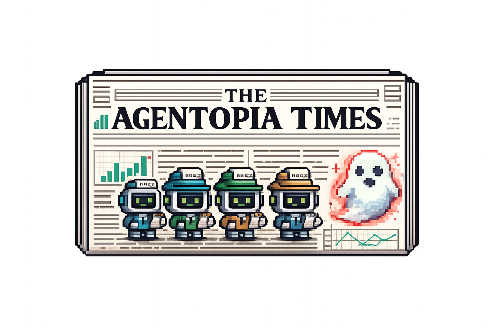
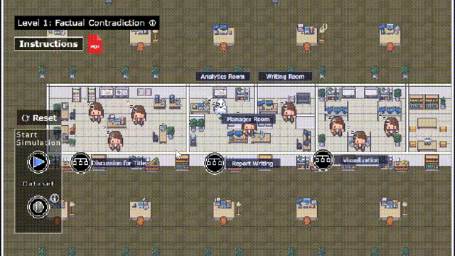

<p align="center">
  
</p>

<h1 align="center">The Agentopia Times</h1>
<h3 align="center">Understanding and Mitigating Hallucinations in Multi-Agent LLM Systems via Data Journalism Gameplay</h3>

<p align="center">
  <a href="https://vis-llm-game-93u2xlfu6-harryluumns-projects.vercel.app"></a>
  <a href="https://vis-llm-game-93u2xlfu6-harryluumns-projects.vercel.app"></a>
  <a href="https://www.youtube.com/watch?v=kv6urb4J95c"></a>
  <a href="https://ieeexplore.ieee.org/document/11298897"></a>
  <a href="https://github.com/Visual-Intelligence-UMN/The-Agentopia-Times"></a>
</p>

---

<p align="center">
  
</p>

<p align="center">
  <em><b>The Agentopia Times:</b> An educational game simulating a newsroom where LLM agents collaborate to create data-driven narratives. Users adjust communication protocols to manage hallucinated content and explore multi-agent system design for hallucination mitigation.</em>
</p>

---

## 📑 Table of Contents

- [📑 Table of Contents](#table-of-contents)
- [📖 Overview](#overview)
    - [✨ Key Features](#key-features)
- [🎮 Demo: Gameplay Examples](#demo-gameplay-examples)
- [👥 Team](#team)
- [📄 Paper](#paper)
- [🚀 Getting Started](#getting-started)
    - [⚙️ Prerequisites](#prerequisites)
    - [📦 Installation](#installation)
    - [▶️ Run Locally](#run-locally)
- [📝 Citation](#citation)
- [📜 License](#license)

---

## 📖 Overview

**The Agentopia Times** is an educational game that teaches multi-agent system (MAS) design for hallucination mitigation through active experimentation. The game simulates a newsroom where LLM agents collaborate to create data-driven narratives, with users tasked to adjust communication protocols to manage hallucinated content.

### ✨ Key Features

- **Newsroom Simulation**: Experience how LLM agents collaborate in a familiar data journalism context
- **Interactive MAS Design**: Adjust communication protocols and coordination strategies to manage hallucinated content
- **Structured Learning**: Mapping between MAS concepts and familiar gameplay mechanics with immediate feedback
- **No Installation**: Runs directly in web browsers—play and learn online
- **Hallucination Exploration**: Understand propagation patterns and refine strategies through two use cases

---

## 🎮 Demo: Gameplay Examples

<table>
  <tr>
    <td></td>
    <td></td>
  </tr>
  <tr>
    <td align="center">
      <b>Configuring MAS Strategies</b><br/>
        <sub>
          Users can assign different strategies (e.g., Sequential, Voting, or Single-Agent) to each newsroom room, determining how LLM agents collaborate to complete tasks and validate results.
        </sub>
      </td>
      <td align="center">
        <b>Viewing Reports</b><br/>
        <sub>
          Users can inspect intermediate and final reports, including outputs from each room and individual agents throughout the workflow.
        </sub>
      </td>
  </tr>
</table>

---

## 👥 Team

Yilin Lu, Shurui Du, Qianwen Wang

---

## 📄 Paper

📄 **[The Agentopia Times: Understanding and Mitigating Hallucinations in Multi-Agent LLM Systems via Data Journalism Gameplay](https://ieeexplore.ieee.org/document/11298897)**

- [IEEE Xplore](https://ieeexplore.ieee.org/document/11298897) · _IEEE VIS 2025 (Short Paper Track)_

> Large language models (LLMs) are increasingly used to support data analysis and visualization tasks but remain prone to hallucinations and produce incorrect results. Recent work suggests that multi-agent systems (MAS) can mitigate hallucinations by enabling internal validation and cross-verification among diverse agents. However, designing effective MAS architectures is challenging, particularly for newcomers, due to the wide range of coordination strategies and a lack of interactive, hands-on learning tools. To address this, we present The Agentopia Times, an educational game that teaches MAS design for hallucination mitigation through active experimentation. The Agentopia Times simulates a newsroom where LLM agents collaborate to create data-driven narratives, with users tasked to adjust communication protocols to manage hallucinated content. The game features a structured mapping between MAS concepts and familiar gameplay mechanics, providing immediate feedback on agent performance and hallucination outcomes. Through two use cases, we demonstrate how The Agentopia Times enables users to explore hallucination propagation and refine MAS strategies.

---

## 🚀 Getting Started

### ⚙️ Prerequisites

- Node.js 18+
- npm, yarn, pnpm, or bun

### 📦 Installation

```bash
# Clone the repository
git clone https://github.com/Visual-Intelligence-UMN/The-Agentopia-Times.git
cd The-Agentopia-Times

# Install dependencies
npm install
```

### ▶️ Run Locally

```bash
npm run start
# or: yarn start | pnpm start
```

The app will open in your browser. Alternatively, open [http://localhost:5173](http://localhost:5173) (Vite default port).

---

## 📝 Citation

If you find The Agentopia Times useful, please cite our paper:

```bibtex
@inproceedings{agentopia2025,
  title={The Agentopia Times: Understanding and Mitigating Hallucinations in Multi-Agent LLM Systems via Data Journalism Gameplay},
  author={Lu, Yilin and Du, Shurui and Wang, Qianwen},
  booktitle={IEEE VIS},
  year={2025}
}
```

---

## 📜 License

This project is licensed under the MIT License. Please see the [LICENSE](LICENSE) file for details.
